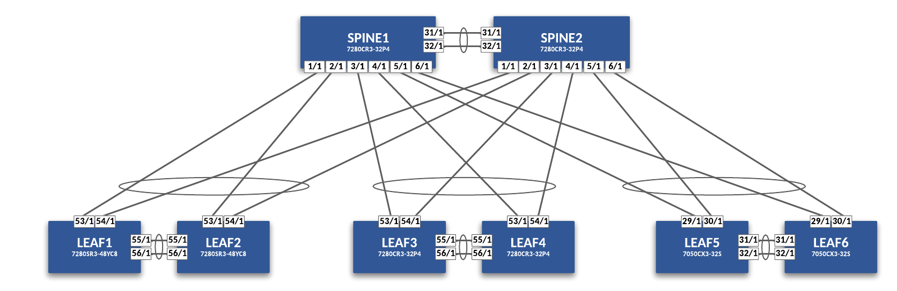

# American Electric Power - ADMS Project

## Sites

### New Albany, OH (NATCC)

- (2) DCS-7280CR3-32P4-F
- (4) DCS-7280SR3-48YC8-F
- (2) DCS-7050CX3-32S-D-F
- (2) DCS-7010TX-48-F

### Roanoke, VA (ROTCC)

- (4) DCS-7280CR3-32P4-F
- (12) DCS-7280SR3-48YC8-F
- (2) DCS-7050CX3-32S-D-F
- (4) DCS-7010TX-48-F

### Corpus Christi, TX (COTCC)

- (2) DCS-7280CR3-32P4-F
- (8) DCS-7280SR3-48YC8-F
- (2) DCS-7050CX3-32S-D-F
- (8) DCS-7010TX-48-F

## Design

The ADMS Project comprises of 3 sites where an L2LS Design will be utilized. AVD will be used to generate configurations and deploy to the network.

## Virtual Test Environment

ContainerLab will be utilized to build a test environment where configurations can be deployed to test functionality of the resulting AVD configuration files. The basic L2LS topo used for building and pushing test configs will be similar to the following.



A Virtual Machine running docker and containerlab will be needed.


## Build & Deploy Configs

Open Repository in devcontainer.  Change directory to `/workspace/Projects/clab-ADMS`. Using a Makefile you can launch a separate build and deploy process for each site.  The below exampale shows building and deploying to the ContainerLab environment.

``` bash
# Build CLAB Configs
make build-clab
```

``` bash
# Deploy CLAB Configs
make deploy-clab
```