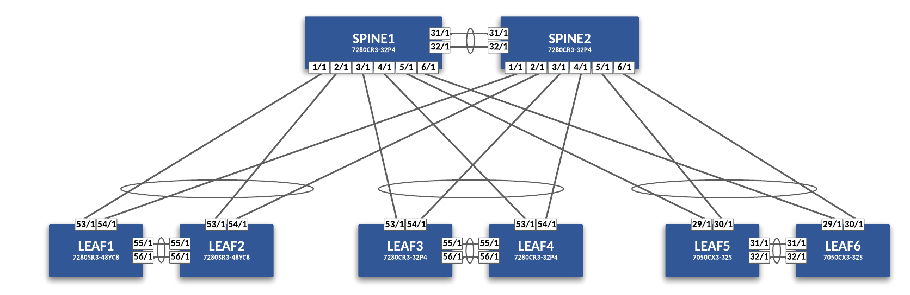

# ContainerLab L2LS Topo

## Demo Topo Hardware

- (2) DCS-7280CR3-32P4-F
- (4) DCS-7280SR3-48YC8-F
- (2) DCS-7050CX3-32S-D-F



## Requirements

- Install [Docker](https://docs.docker.com/engine/install/)
- Install [ContainerLab](https://containerlab.dev/install/)
- Import cEOS Docker Image (4.29.1F) from Arista. **Note:** You may also install a different cEOS version and update topology file accordingly.

## Start Lab

Copy the topology file to your host running ContainerLab and Docker and start the lab with the following command.  Update the path to file as necessary.

``` bash
sudo clab deploy -t clab/l2ls-lab-topo.yaml --reconfigure
```

## Stop Lab

``` bash
sudo clab destroy -t clab/l2ls-lab-topo.yaml --cleanup
```